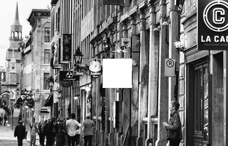
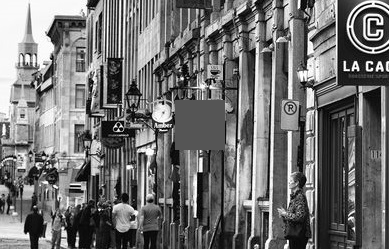

# HoleFilling

Hole filling solution, written in C#. Divided into 3 separate project:

* Class library - contains the core logic
* Console app - used to manual test it
* Test library - MStests for the Trace algorithm

The class library contains 3 main object:

* ImageHandler - loads an image using Emgu (OpenCv for .NET), grayscales it, and converts it into a Pixel Matrix, each containing a float value between [0,1]. Can also be used to create missing values (holes) in it (-1), and to save changes to the file or to a new file.
* HoleFinder - Takes a Matrix and Finds the hole (boundary of the hole, minimal covering rectangle, and the hole-pixels themselves) in it. Uses Moore-Tracing algorithm as default, but can be supplied other algorithms as well.
* HoleFixer - Takes a Matrix and a Hole, and fixes the hole. Default fix is using a weight function. Default weight function is implemented.

  * Weight Function - hole pixel new value is weighted averaged between of distance between it and all boundary pixels
  * Average - hole pixel new value is the average of all boundary pixels
  * Gradient - hole pixel new value is calculated by a gradient from 4 edges of the covering rectangle
  * Spiral 8-connected-pixels - hole pixel new value is average of all non-missing 8-connected pixels. This is done in spiral manner for best results.
  
# Performance

Hole:

Best: Weight

2nd: Spiral 8-Connected

Poor: Gradient

Very poor: Average

# Time Complexity

Given an image of K x L pixels, with a hole of N pixels, and a boundary of M pixels.

1) Finding the original starting location of the hole will take on average ((K x L) - N) / 2, which is in the magnitude of O(K x L).

2) Finding the boundary of the hole (using [Moore's algorithm](http://www.imageprocessingplace.com/downloads_V3/root_downloads/tutorials/contour_tracing_Abeer_George_Ghuneim/moore.html)): 

   In the best case, the shape is a perfect square. The boundary tracing algorithm will be around 12√N (√N for each side, times 4 sides, times 3 for the algorithm redundancy - i.e. if we go right and down and find a hole pixel, we will now have to go up, right and down - just to get to the next hole - that's 3 steps). This is O(√N).

   In the worst case, the shape is a perfect diagonal. Tracing algorithm will be around 8N (we will traverse the diagonal from two of its sides (x2) and for ~all hole pixels we will require 4 steps to move from one hole-pixel to another).  This is O(N).

3) O(M) is between O(√N) (best case - square) to O(N) (worst case - diagonal).

4) Finding the hole itself - the algorithm first finds minimal covering rectangle, and then traverse the rectangle and collects the hole pixels. In the best case (perfect square) it will be in O(M+N) = O(N) (M for finding min,max values for start and end of rectangle search), in the worst (perfect diagonal) it will be O(M + N^2/2) = O(N^2).

5) The filling algorithm:

   Using the default weight function will require to calculate M values for each hole, i.e. it's of O(MxN). Since O(M) is between O(√N) to O(N) the total magnitude is between O(N^1.5) to O(N^2)  

   Using the 8-connected-spiral best approximation will require only a constant multiplication of N (around 3-4 and no more than 8) - hence will take O(N)
